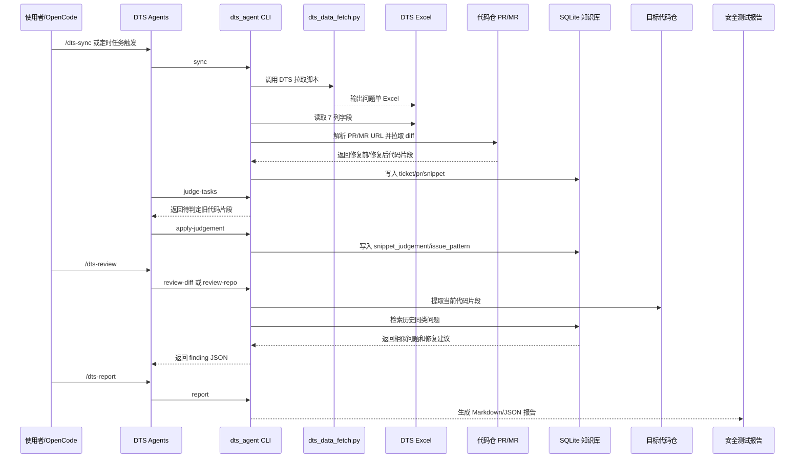

# DTS Guardian for OpenCode

本项目实现本地 OpenCode 工作流：调用现有 `dts_data_fetch.py` 拉取 DTS Excel，解析 `修改文件清单` 中的 GitCode、CodeHub 或其他已配置代码仓 PR/MR URL，提取修复前/修复后代码片段，沉淀到 SQLite 安全知识库，并在新项目仓中匹配同类代码问题、生成安全测试报告。

## 三层架构图


### 分层职责

- 第 1 层负责本地 OpenCode 操作入口和定时任务入口，不直接实现业务逻辑。
- 第 2 层负责所有可测试的核心逻辑，包括 Excel 导入、PR/MR URL 标准化、多代码仓 diff 解析、问题模式抽取、相似代码检视和报告生成。
- 第 3 层负责数据来源和落地结果，包括 `dts_data_fetch.py`、DTS Excel、GitCode/CodeHub/自定义代码仓 PR 或 MR、SQLite 知识库、目标代码仓和最终报告。

## 端到端工作流



### 工作流说明

- `/dts-sync`：手动触发同步，默认调用 `dts_agent\dts_tools\dts_data_fetch.py`，导入 Excel，按 URL 域名动态识别并抓取 GitCode、CodeHub 或自定义代码仓 diff；OpenCode Agent 模式下先写入 ticket/pr/snippet，再由 agent 判定是否入知识库。
- Windows 定时任务：周期性执行同一条 `sync` 链路，用于无人值守增量更新。
- `/dts-query`：按问题单号、问题类型、关键词或代码片段查询历史安全知识。
- `/dts-review`：检视当前 git diff 或完整仓库，匹配历史同类问题，输出风险等级、文件位置、相似问题单、证据和修复建议。
- `/dts-report`：基于最近一次检视结果生成安全测试报告，默认输出 Markdown，同时支持 JSON。

## 运行方式

初始化：

```powershell
python -m dts_agent init --json
```

手动同步 DTS：

```powershell
python -m dts_agent sync --json
```

如果已经有 Excel/CSV 文件，可以直接读取，不运行 `dts_data_fetch.py`：

```powershell
python -m dts_agent sync --file D:\Upload\dts.xlsx --skip-build-kb --json
```

如果要运行 `dts_data_fetch.py`，并指定生成文件落地目录：

```powershell
python -m dts_agent sync --output-dir D:\Upload\dts_excel --skip-build-kb --json
```

如果要把生成结果复制到指定文件名：

```powershell
python -m dts_agent sync --output-file D:\Upload\dts_excel\dts_latest.xlsx --skip-build-kb --json
```

OpenCode Agent 判定模式：

```powershell
# 清掉错误知识和旧判定，保留已经导入的 DTS/PR/snippet
python -m dts_agent clear-kb --include-judgements --json

# 同步数据但不使用 Python 启发式规则自动建库
python -m dts_agent sync --skip-build-kb --json

# 导出待 OpenCode agent 判定的修复前代码片段
python -m dts_agent judge-tasks --limit 5 --json

# OpenCode agent 判定后写回；只有 has-security-issue=true 且 confidence>=0.5 才会生成 issue_pattern
python -m dts_agent apply-judgement --snippet-id <snippet_id> `
  --has-security-issue true `
  --issue-type "命令注入风险" `
  --confidence 0.9 `
  --rationale "修复前代码使用外部输入构造命令并调用 popen。" `
  --json
```

知识提取会先比较修复前/修复后的代码变更。仅注释、空行、格式调整、变量名风格调整或普通变量改名不会进入安全判定队列，也不会生成知识库条目。

查询知识库：

```powershell
python -m dts_agent query --query "权限校验缺失" --limit 5 --json
```

查看当前数据库内容：

```powershell
python -m dts_agent inspect-db --limit 10 --json
```

使用大模型判定修复前代码是否确实存在安全问题：

```powershell
$env:DTS_AGENT_LLM_COMMAND = "python D:\Upload\DTS_agent_new\scripts\your_llm_judge.py"
python -m dts_agent build-kb --rebuild --require-llm --json
```

大模型判定程序从标准输入读取 JSON，必须输出严格 JSON：

```json
{
  "has_security_issue": true,
  "issue_type": "命令注入风险",
  "confidence": 0.9,
  "rationale": "修复前代码使用外部可控命令字符串调用 popen。"
}
```

也可以配置 HTTP 服务：

```powershell
$env:DTS_AGENT_LLM_URL = "http://127.0.0.1:8000/judge"
$env:DTS_AGENT_LLM_TOKEN = "<optional token>"
python -m dts_agent import-excel --file .\data\inbox\dts.xlsx --require-llm --json
```

检视当前仓库：

```powershell
python -m dts_agent review-repo --path . --json
python -m dts_agent report --review-id latest --format md
```

排除测试目录或第三方目录：

```powershell
python -m dts_agent review-repo --path D:\code\ubs-engine --exclude test --exclude tests --json
python -m dts_agent review-diff --path D:\code\ubs-engine --base HEAD~1 --exclude test --json
```

## Windows 定时同步

注册每小时同步任务：

```powershell
powershell -ExecutionPolicy Bypass -File .\scripts\register_windows_task.ps1 `
  -ProjectRoot "D:\Upload\DTS_agent_new" `
  -FetchScript "D:\Upload\DTS_agent_new\dts_agent\dts_tools\dts_data_fetch.py" `
  -IntervalMinutes 60
```

任务会执行：

```powershell
python -m dts_agent --root <ProjectRoot> sync --mode scheduled --fetch-script <ProjectRoot>\dts_agent\dts_tools\dts_data_fetch.py
```

## OpenCode 工作流

项目已包含 `.opencode/` 配置：

- `/dts-sync`：运行 `dts-sync-maintainer`，同步 DTS Excel 与 PR diff。
- `/dts-review`：运行 `dts-guardian`，检视当前 git diff 或仓库。
- `/dts-report`：运行 `dts-report-writer`，生成 Markdown/JSON 安全测试报告。
- `/dts-query`：查询历史同类问题。

`/dts-sync` 支持在 OpenCode 中传入 Excel 读取或生成路径：

```text
/dts-sync excel=D:\Upload\dts.xlsx
/dts-sync output-dir=D:\Upload\dts_excel
/dts-sync output-file=D:\Upload\dts_excel\dts_latest.xlsx
```

其中 `excel=` 或 `file=` 只读取已有文件，不运行 `dts_data_fetch.py`，也不会生成新文件；`output-dir=` 表示运行拉取脚本并让 `dts_data_fetch.py` 输出到指定目录；`output-file=` 表示运行拉取脚本并让 `dts_data_fetch.py` 输出到指定 `.xlsx` 或 `.csv` 文件。后续知识库导入会从这个指定路径读取。

如果在其他项目仓复用这套 OpenCode 配置，设置：

```powershell
$env:DTS_AGENT_HOME = "D:\Upload\DTS_agent_new"
$env:PYTHONPATH = "$env:DTS_AGENT_HOME;$env:PYTHONPATH"
$env:GITCODE_ACCESS_TOKEN = "<your token>"
```

## 输入格式

Excel/CSV 固定读取 7 列：

- `序号`
- `问题单号`
- `简要描述`
- `严重程度`
- `创建时间`
- `提出方`
- `修改文件清单`

`修改文件清单` 支持这种列表字符串：

```text
['https://gitcode.com/openeuler/ubs-engine/pull/466']
['https://codehub-y.huawei.com/group/repo/-/merge_requests/123']
['https://szy-y.codehub.huawei.com/group/subgroup/repo/pulls/456']
```

一个问题单可包含多个 URL。

## 多代码仓配置

URL 解析会根据 `修改文件清单` 中的域名自动识别代码仓类型：

- `gitcode.com` 默认识别为 `gitcode`，优先调用 GitCode PR 文件接口，再回退 `.diff`。
- `codehub-y.huawei.com`、`szy-y.codehub.huawei.com` 以及包含 `codehub` 且以 `huawei.com` 结尾的域名默认识别为 `codehub`，优先尝试常见 CodeHub/GitLab MR API，再回退 `.diff/.patch`。
- 未知域名默认识别为 `generic`，会使用原始 URL 的 `.diff/.patch` 形式尝试抓取。

`/dts-sync` 和 `dts_import_excel` 会先解析 Excel 中全部 PR/MR URL，再统一检查哪些代码仓缺少访问 token。OpenCode 工具默认启用交互式 token 配置：如果多个代码仓都缺少 token，会弹出一次本地窗口批量填写，并可写入 Windows 用户环境变量；配置完成后才继续抓取 diff。

如需动态扩展域名，不需要改代码，可配置环境变量：

```powershell
$env:DTS_REPO_HOSTS = "git.example.com=generic,codehub.example.com=codehub"
$env:DTS_REPO_HOSTS_JSON = '{"codehub-y.huawei.com":{"provider":"codehub"},"git.example.com":{"provider":"generic"}}'
```

访问凭证按优先级读取：

```powershell
$env:GITCODE_ACCESS_TOKEN = "<gitcode token>"
$env:CODEHUB_ACCESS_TOKEN = "<codehub token>"
$env:DTS_REPO_ACCESS_TOKEN = "<generic repository token>"
$env:DTS_REPO_TOKEN_CODEHUB_Y_HUAWEI_COM = "<host specific token>"
```

`DTS_REPO_TOKEN_<HOST>` 的 `<HOST>` 使用大写，并将域名中的 `.`、`-` 等非字母数字字符替换为 `_`。

## 轻量化约束

- 不依赖 PostgreSQL、pgvector、openpyxl、requests、numpy。
- SQLite 单文件存储，使用 FTS5 和纯 Python 相似度计算。
- GitCode、CodeHub 和自定义代码仓 token 均从环境变量读取。
- 没有可提取代码片段的问题单不会生成知识条目。
