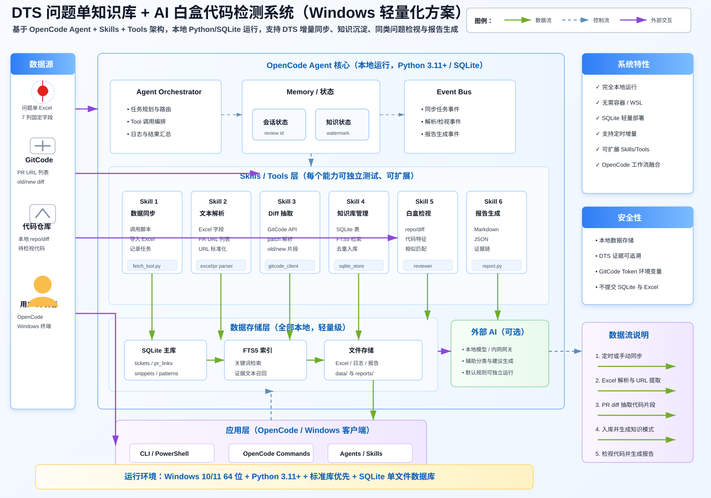
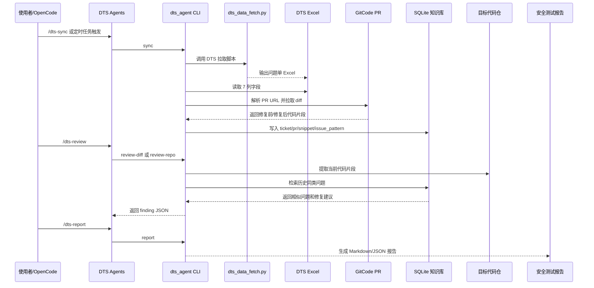

# DTS Guardian for OpenCode

本项目实现本地 OpenCode 工作流：调用现有 `dts_data_fetch.py` 拉取 DTS Excel，解析 `修改文件清单` 中的 GitCode PR URL，提取修复前/修复后代码片段，沉淀到 SQLite 安全知识库，并在新项目仓中匹配同类代码问题、生成安全测试报告。

## 三层架构图



### 分层职责

- 第 1 层负责本地 OpenCode 操作入口和定时任务入口，不直接实现业务逻辑。
- 第 2 层负责所有可测试的核心逻辑，包括 Excel 导入、PR URL 标准化、GitCode diff 解析、问题模式抽取、相似代码检视和报告生成。
- 第 3 层负责数据来源和落地结果，包括 `dts_data_fetch.py`、DTS Excel、GitCode PR、SQLite 知识库、目标代码仓和最终报告。

## 端到端工作流



### 工作流说明

- `/dts-sync`：手动触发同步，默认调用 `dts_agent\dts_tools\dts_data_fetch.py`，导入 Excel，抓取 GitCode PR diff，更新 SQLite 知识库。
- Windows 定时任务：周期性执行同一条 `sync` 链路，用于无人值守增量更新。
- `/dts-query`：按问题单号、问题类型、关键词或代码片段查询历史安全知识。
- `/dts-review`：检视当前 git diff 或完整仓库，匹配历史同类问题，输出风险等级、文件位置、相似问题单、证据和修复建议。
- `/dts-report`：基于最近一次检视结果生成安全测试报告，默认输出 Markdown，同时支持 JSON。

## 运行方式

初始化：

```powershell
python -m dts_agent init --json
```

手动同步 DTS：

```powershell
python -m dts_agent sync --json
```

如果已经有 Excel 文件：

```powershell
python -m dts_agent import-excel --file .\data\inbox\dts.xlsx --json
```

查询知识库：

```powershell
python -m dts_agent query --query "权限校验缺失" --limit 5 --json
```

检视当前仓库：

```powershell
python -m dts_agent review-repo --path . --json
python -m dts_agent report --review-id latest --format md
```

## Windows 定时同步

注册每小时同步任务：

```powershell
powershell -ExecutionPolicy Bypass -File .\scripts\register_windows_task.ps1 `
  -ProjectRoot "D:\Upload\DTS_agent_new" `
  -FetchScript "D:\Upload\DTS_agent_new\dts_agent\dts_tools\dts_data_fetch.py" `
  -IntervalMinutes 60
```

任务会执行：

```powershell
python -m dts_agent --root <ProjectRoot> sync --mode scheduled --fetch-script <ProjectRoot>\dts_agent\dts_tools\dts_data_fetch.py
```

## OpenCode 工作流

项目已包含 `.opencode/` 配置：

- `/dts-sync`：运行 `dts-sync-maintainer`，同步 DTS Excel 与 PR diff。
- `/dts-review`：运行 `dts-guardian`，检视当前 git diff 或仓库。
- `/dts-report`：运行 `dts-report-writer`，生成 Markdown/JSON 安全测试报告。
- `/dts-query`：查询历史同类问题。

如果在其他项目仓复用这套 OpenCode 配置，设置：

```powershell
$env:DTS_AGENT_HOME = "D:\Upload\DTS_agent_new"
$env:PYTHONPATH = "$env:DTS_AGENT_HOME;$env:PYTHONPATH"
$env:GITCODE_ACCESS_TOKEN = "<your token>"
```

## 输入格式

Excel/CSV 固定读取 7 列：

- `序号`
- `问题单号`
- `简要描述`
- `严重程度`
- `创建时间`
- `提出方`
- `修改文件清单`

`修改文件清单` 支持这种列表字符串：

```text
['https://gitcode.com/openeuler/ubs-engine/pull/466']
```

一个问题单可包含多个 URL。

## 轻量化约束

- 不依赖 PostgreSQL、pgvector、openpyxl、requests、numpy。
- SQLite 单文件存储，使用 FTS5 和纯 Python 相似度计算。
- GitCode token 从 `GITCODE_ACCESS_TOKEN` 读取。
- 没有可提取代码片段的问题单不会生成知识条目。
