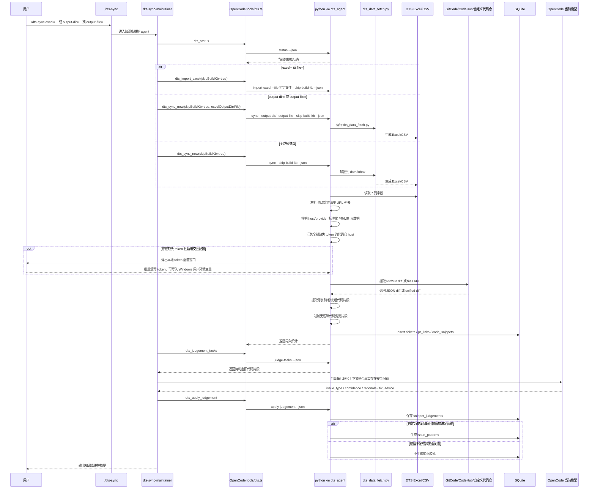
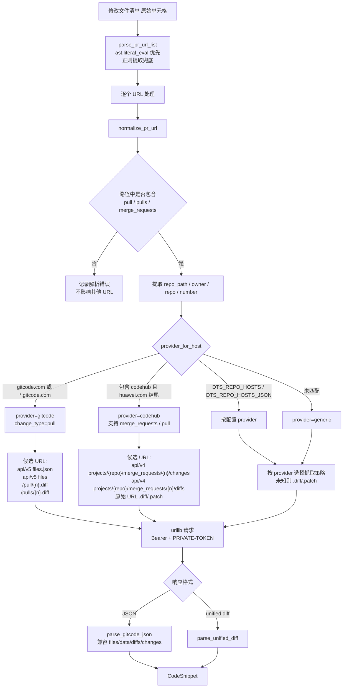
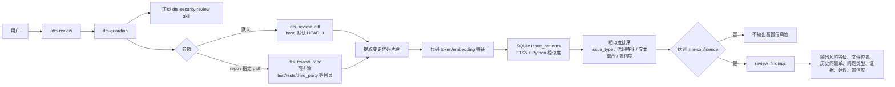
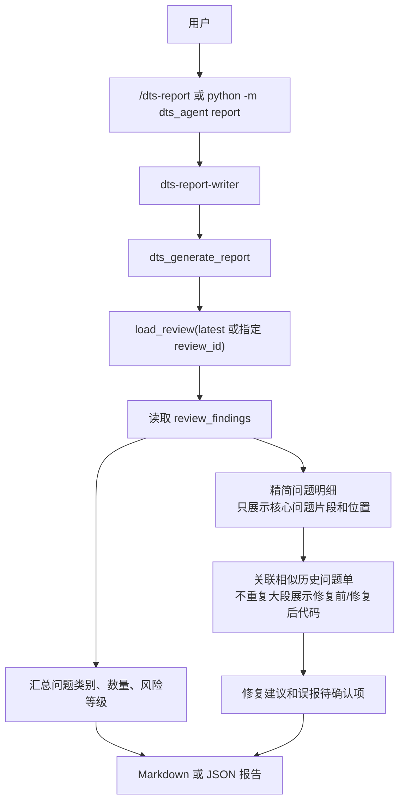

# DTS Guardian 最新工作流程图

本文档描述当前代码版本的完整执行链路，覆盖本地 OpenCode 命令、Python CLI、DTS Excel 导入、多代码仓 PR/MR diff 抓取、OpenCode Agent 安全判定、SQLite 知识库、代码检视和报告生成。

## 总体流程

```mermaid
flowchart LR
  User["用户 / OpenCode"] --> Cmd{"OpenCode 命令"}

  Cmd -->|"/dts-sync"| SyncAgent["dts-sync-maintainer"]
  Cmd -->|"/dts-review"| Guardian["dts-guardian"]
  Cmd -->|"/dts-query"| Query["dts_kb_query"]
  Cmd -->|"/dts-report"| ReportAgent["dts-report-writer"]

  SyncAgent --> SyncTool["dts_sync_now / dts_import_excel"]
  SyncTool --> FetchMode{"输入方式"}
  FetchMode -->|"excel= / file="| ExistingExcel["读取指定 Excel/CSV\n不运行 dts_data_fetch.py"]
  FetchMode -->|"output-dir= / output-file="| FetchScript["运行 dts_data_fetch.py\n输出到指定目录/文件"]
  FetchMode -->|"无参数"| DefaultFetch["运行 dts_data_fetch.py\n输出到默认 inbox"]

  FetchScript --> Excel["DTS Excel/CSV"]
  DefaultFetch --> Excel
  ExistingExcel --> Excel

  Excel --> Import["Excel 7 列解析\n序号/问题单号/简要描述/严重程度/创建时间/提出方/修改文件清单"]
  Import --> UrlParser["PR/MR URL 解析器\nast.literal_eval + 正则兜底"]
  UrlParser --> TokenCheck["统一检查全部 PR/MR host\n缺 token 则一次性弹窗配置"]
  TokenCheck --> Provider{"按 URL host 识别代码仓"}
  Provider -->|"gitcode.com"| GitCode["GitCode PR API\n/files.json / files / .diff"]
  Provider -->|"codehub*.huawei.com"| CodeHub["CodeHub/GitLab 风格 API\nmerge_requests changes/diffs\n.diff/.patch 兜底"]
  Provider -->|"DTS_REPO_HOSTS 配置或未知域名"| GenericRepo["Generic 仓库\n原始 URL .diff/.patch 兜底"]

  GitCode --> DiffParser["diff 解析器\nold/new 代码片段"]
  CodeHub --> DiffParser
  GenericRepo --> DiffParser
  DiffParser --> LogicalChange{"是否存在逻辑代码变更"}
  LogicalChange -->|"否：注释/空行/格式/变量名无实质变化"| SkipSnippet["跳过安全知识入库"]
  LogicalChange -->|"是"| Snippets["code_snippets"]

  Import --> Tickets["dts_tickets"]
  UrlParser --> Links["pr_links\nhost/provider/change_type/repo_path"]
  Tickets --> SQLite["SQLite 知识库"]
  Links --> SQLite
  Snippets --> SQLite

  SQLite --> JudgeTasks["dts_judgement_tasks"]
  JudgeTasks --> SyncAgent
  SyncAgent --> AgentJudge["OpenCode 当前模型判定\n旧代码 + 上下文是否仍有安全问题"]
  AgentJudge --> ApplyJudge["dts_apply_judgement"]
  ApplyJudge -->|"hasSecurityIssue=false"| JudgementOnly["仅保存 judgement\n不生成 issue_pattern"]
  ApplyJudge -->|"hasSecurityIssue=true 且 confidence>=0.5"| Patterns["issue_patterns + FTS5 + embedding"]
  JudgementOnly --> SQLite
  Patterns --> SQLite

  Guardian --> ReviewMode{"检视方式"}
  ReviewMode -->|"默认"| ReviewDiff["dts_review_diff\n扫描当前 git diff"]
  ReviewMode -->|"repo 参数或显式工具"| ReviewRepo["dts_review_repo\n扫描指定目录/全仓"]
  ReviewDiff --> Matcher["代码片段提取 + 知识库相似匹配"]
  ReviewRepo --> Matcher
  SQLite --> Matcher
  Matcher --> Findings["review_findings\n风险等级/位置/问题类型/历史问题单/证据/建议/置信度"]
  Findings --> SQLite

  Query --> SQLite
  SQLite --> QueryResult["历史问题查询结果"]

  ReportAgent --> ReportTool["dts_generate_report"]
  SQLite --> ReportTool
  ReportTool --> Report["安全测试报告\nMarkdown / JSON"]
```



## `/dts-sync` 维护知识库流程



## 多代码仓 URL 解析与抓取分支



## `/dts-review` 检视流程



## `/dts-report` 报告流程



## 关键数据落点

| 阶段 | 表/文件 | 主要内容 |
| --- | --- | --- |
| DTS 导入 | `dts_tickets` | 问题单号、摘要、严重程度、创建时间、提出方、原始行 JSON |
| URL 解析 | `pr_links` | PR/MR URL、host、provider、change_type、repo_path、状态和错误 |
| diff 解析 | `code_snippets` | 文件路径、旧行号、新行号、修复前片段、修复后片段、上下文 |
| Agent 判定 | `snippet_judgements` | 是否真实安全问题、问题类型、置信度、理由、修复建议 |
| 知识模式 | `issue_patterns` / `issue_patterns_fts` | 可检索安全知识、代码特征、fingerprint、embedding |
| 代码检视 | `review_runs` / `review_findings` | 检视批次、问题位置、匹配历史问题单、证据、建议 |
| 报告输出 | `reports/dts_security_report_<timestamp>.md` | 安全测试报告 |

## 常用命令映射

| 场景 | OpenCode 命令 | Python CLI |
| --- | --- | --- |
| 导入指定 Excel，不运行拉取脚本 | `/dts-sync excel=D:\Upload\dts.xlsx` | `python -m dts_agent sync --file D:\Upload\dts.xlsx --skip-build-kb --json` |
| 运行拉取脚本并指定输出目录 | `/dts-sync output-dir=D:\Upload\dts_excel` | `python -m dts_agent sync --output-dir D:\Upload\dts_excel --skip-build-kb --json` |
| 运行拉取脚本并指定输出文件 | `/dts-sync output-file=D:\Upload\dts_excel\dts_latest.xlsx` | `python -m dts_agent sync --output-file D:\Upload\dts_excel\dts_latest.xlsx --skip-build-kb --json` |
| 查看待 OpenCode 判定片段 | agent 自动执行 | `python -m dts_agent judge-tasks --limit 5 --json` |
| 检视当前 diff | `/dts-review` | `python -m dts_agent review-diff --path . --base HEAD~1 --json` |
| 检视全仓 | `/dts-review repo` | `python -m dts_agent review-repo --path . --json` |
| 排除目录扫描 | 工具参数 `exclude` | `python -m dts_agent review-repo --path D:\code\repo --exclude test --exclude tests --json` |
| 查询知识库 | `/dts-query 命令注入` | `python -m dts_agent query --query "命令注入" --limit 10 --json` |
| 生成报告 | `/dts-report` | `python -m dts_agent report --review-id latest --format md --json` |

## 多代码仓配置入口

```powershell
# 简单 host=provider 配置
$env:DTS_REPO_HOSTS = "git.example.com=generic,codehub.example.com=codehub"

# JSON 配置，适合多个内部域名
$env:DTS_REPO_HOSTS_JSON = '{"codehub-y.huawei.com":{"provider":"codehub"},"szy-y.codehub.huawei.com":{"provider":"codehub"}}'

# 访问凭证
$env:GITCODE_ACCESS_TOKEN = "<gitcode token>"
$env:CODEHUB_ACCESS_TOKEN = "<codehub token>"
$env:DTS_REPO_ACCESS_TOKEN = "<generic repository token>"
$env:DTS_REPO_TOKEN_CODEHUB_Y_HUAWEI_COM = "<host specific token>"
```

OpenCode 中 `/dts-sync` 默认启用交互式 token 配置。流程会先解析 Excel 中所有 PR/MR URL，汇总全部缺失 token 的 host，再弹出一次本地窗口批量填写；填写完成后才继续抓取 diff。

## 判定策略

- DTS 摘要只作为问题类型候选，不直接生成知识。
- 修复前旧代码和上下文必须能支撑“仍存在安全问题”，才允许进入 `issue_patterns`。
- 如果摘要问题类型和代码证据一致，使用摘要问题类型。
- 如果摘要问题类型和代码证据不一致，使用代码证据支持的问题类型。
- 如果只是注释、空行、格式、普通变量名调整或无逻辑变化，不进入知识库。
- `/dts-sync` 只维护知识库，不做业务仓代码审计，不生成安全审查报告。
- `/dts-review` 才执行代码检视，`/dts-report` 才生成报告。
